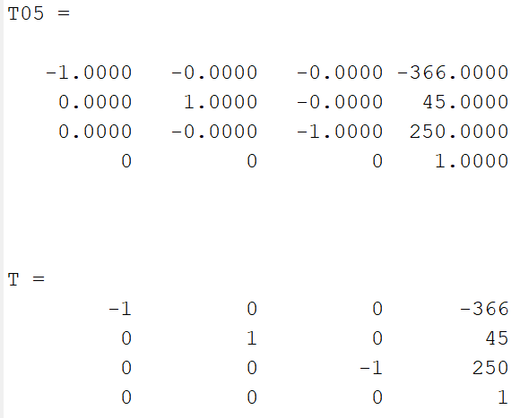
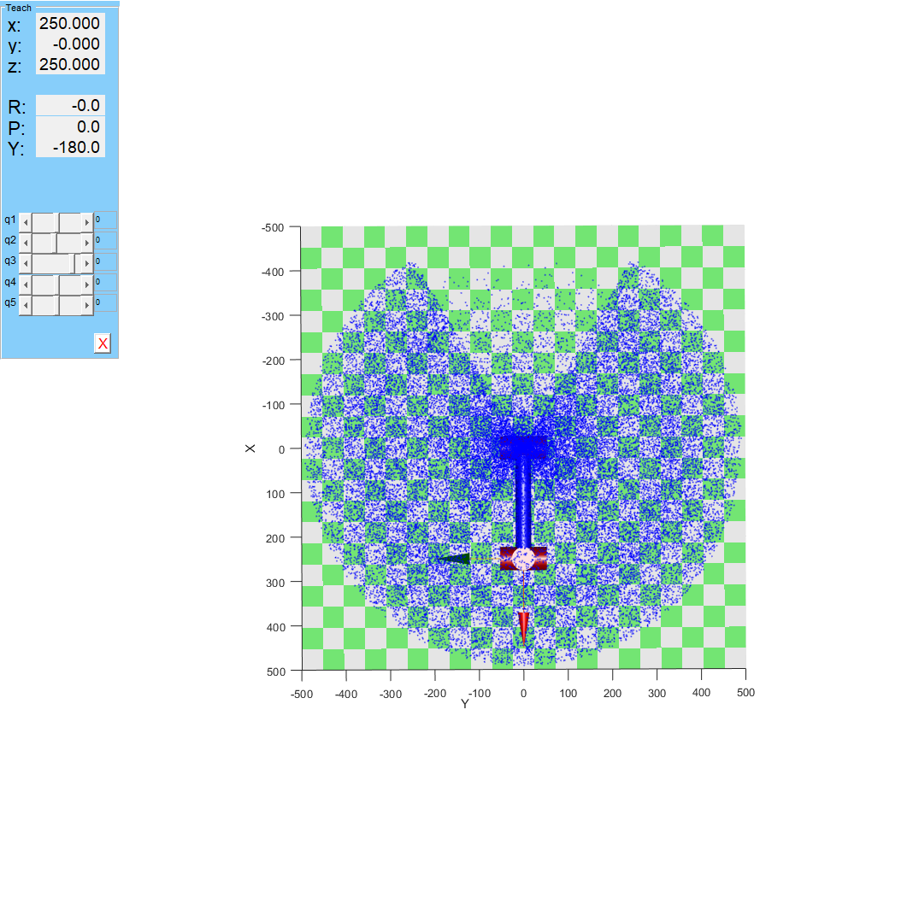
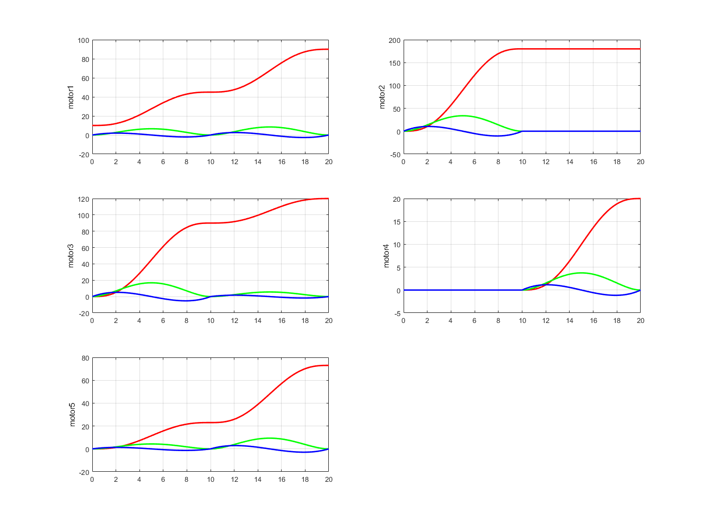
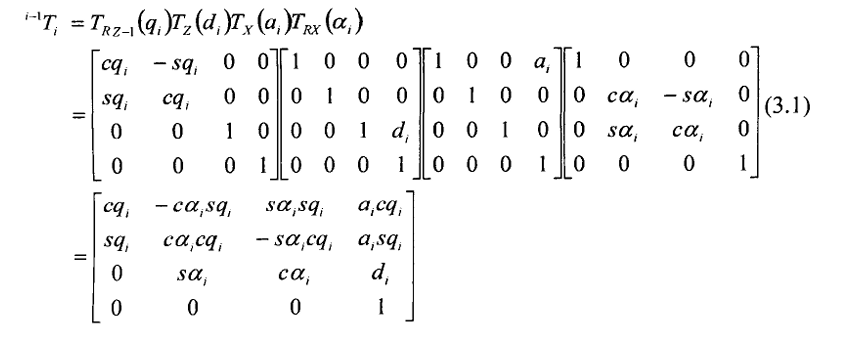
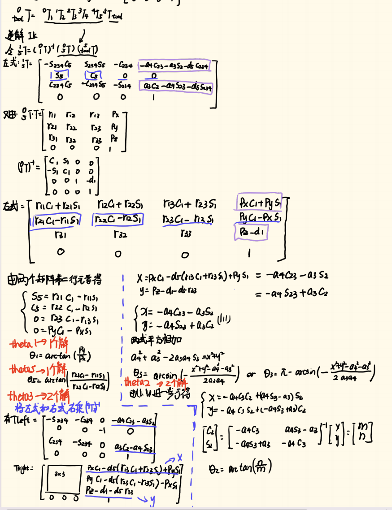
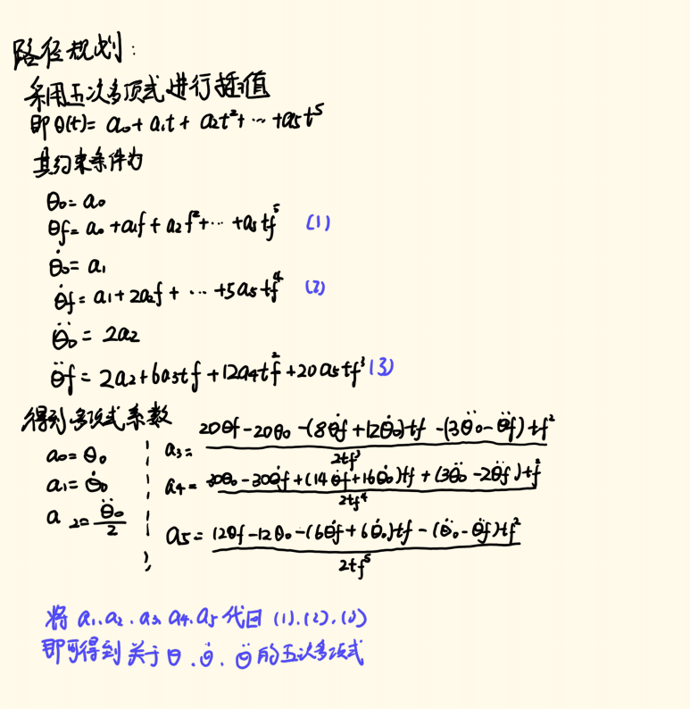
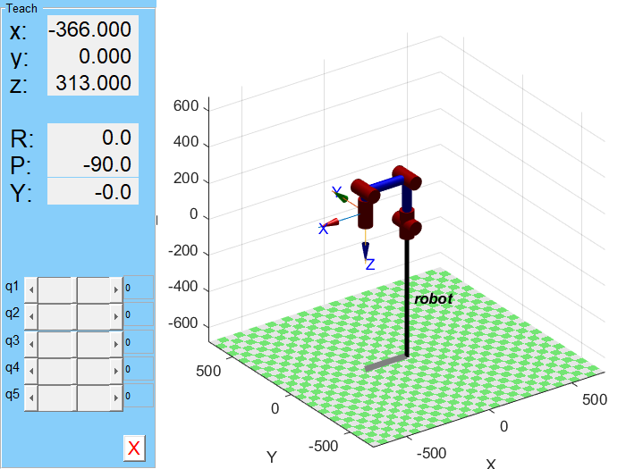
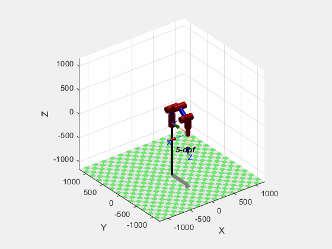
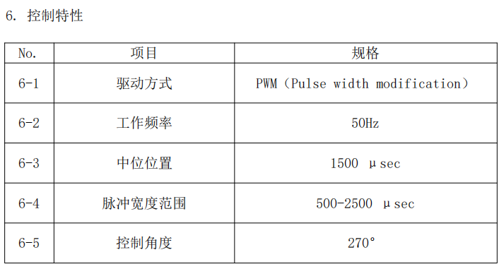

# Robot Arm 1.0

基于 STM32F446、FreeRTOS、MATLAB 运动学仿真与 YOLO 视觉识别的桌面级五轴机械臂项目。

---

## 项目简介

本项目实现了从视觉目标检测到机械臂抓取规划的全流程自动化。双目相机结合 YOLOv5 识别目标物体并计算三维坐标，通过串口发送至 STM32 主控；主控运行逆运动学解算与五次多项式轨迹规划，经 CAN 总线驱动关节电机，PWM 控制夹爪完成抓取。

---

## 系统架构

```text
双目相机 / YOLOv5 视觉模块
        |
        | UART: 目标类别 + 三维坐标
        v
STM32F446 + FreeRTOS 主控
        |
        | IK 逆解 / 轨迹规划 / 控制指令
        v
CAN 总线电机 (关节1-5) + PWM 夹爪舵机
```

### 工作流程

1. 双目相机采集图像，YOLOv5 识别目标物体类别与像素位置
2. 深度定位模块计算目标三维空间坐标
3. 通过 UART 串口发送目标数据至 STM32
4. STM32 运行逆运动学解算，得到各关节目标角度
5. 五次多项式轨迹规划生成平滑运动曲线
6. CAN 总线控制关节电机，PWM 控制夹爪抓取

---

## 嵌入式软件分层

```text
Application Layer (应用层)
  IK / path_planning / control_data

Task Layer (任务层)
  Kinemat_Task / Arm_Task

Device & DriverLayer (设备与驱动层)
  Servos / CAN / UART

BSP Layer (板级支持包)
  CAN 协议封装 / 公共数据结构

HAL Layer (硬件抽象层)
  STM32F4xx HAL + CMSIS + FreeRTOS
```

---

## 目录结构

```text
Robot_Arm_1.0-main/
├── MATLAB仿真/              # 运动学建模、FK/IK、轨迹规划与工作空间仿真
│   ├── main.m               # 主仿真脚本
│   ├── FK.m / IK.m          # 正/逆运动学函数
│   ├── path_calc.m          # 五次多项式轨迹规划
│   ├── path_planning.m      # 轨迹规划与仿真
│   ├── target_calc.m        # 目标坐标转换
│   ├── Our_Manipulator.m    # 改进 DH 建模与示教
│   └── symbol.mlx           # 符号计算推导
├── Robotic_Arm/             # STM32F446 嵌入式固件工程
│   ├── Src/                 # CubeMX 外设初始化
│   ├── MDK-ARM/
│   │   ├── App/             # IK / 轨迹规划 / 控制数据
│   │   ├── Bsp/             # CAN 封装与通用结构体
│   │   ├── Device/          # 舵机驱动
│   │   ├── DriverLayer/     # CAN / UART 用户接口
│   │   └── Task/            # FreeRTOS 任务
│   └── Middlewares/         # FreeRTOS
├── vision/                  # YOLOv5 + 双目深度定位 + 串口
│   └── last_project.py
├── Solid Works/             # 机械臂 SolidWorks 装配模型
│   └── 超级修改臂.SLDASM
├── doc/                     # 原理图与参考资料
├── img/                     # 图片资源
├── 机械臂开发手册.md         # 完整开发文档
└── readme.md
```

---

## 硬件配置

| 项目 | 配置 |
| --- | --- |
| 主控芯片 | STM32F446RCTx (Cortex-M4, 180MHz) |
| 实时系统 | FreeRTOS |
| 电机驱动 | CAN 总线 (达妙电机 x4) |
| 夹爪舵机 | SG90 (PWM 控制) |
| 通信接口 | CAN, UART (DMA), GPIO, TIM |
| 自由度 | 5 轴旋转关节 + 1 夹爪 |
| 连杆长度 | a3 = 250mm, a4 = 250mm |
| 视觉平台 | Jetson Nano / PC (Python, OpenCV) |
| 相机 | 双目深度相机 |
| 建模方法 | Modified DH (改进 DH 参数法) |

### DH 参数表

| 关节 | theta | d (mm) | a (mm) | alpha | offset |
| --- | --- | ---: | ---: | ---: | ---: |
| 1 | q1 | 63 | 0 | 0 | 0 |
| 2 | q2 | 0 | 0 | pi/2 | pi/2 |
| 3 | q3 | 0 | 250 | 0 | pi/2 |
| 4 | q4 | 0 | 250 | 0 | -pi/2 |
| 5 | q5 | 116 | 0 | -pi/2 | 0 |

---

## 核心特性

| 特性 | 说明 |
| --- | --- |
| 机械结构 | 5 轴旋转关节 + 夹爪，改进 DH 参数法建模 |
| 运动学 | 代数法解析逆解 + 五次多项式关节空间轨迹规划 |
| 嵌入式 | FreeRTOS 多任务, CAN/CAN2 双总线, DMA 串口 |
| 电机控制 | MIT 模式 / 位置速度模式 / 速度模式三模式切换 |
| 视觉 | YOLOv5 目标检测 + 双目深度定位 |
| 仿真 | MATLAB Robotics Toolbox 全流程仿真验证 |
| 通信 | 蓝牙 CH05 模块 APP 遥控 + 视觉串口数据链 |
| 机械设计 | SolidWorks 三维装配模型 |
| 开发工具 | STM32CubeMX + Keil MDK-ARM + VS Code |

---

## 通信协议

### CAN 总线（电机控制）

| 参数 | 值 |
| --- | --- |
| 波特率 | 1 Mbps |
| 帧格式 | 标准帧 (11-bit ID) |
| 数据长度 | 8 字节 |
| 控制频率 | ~1 kHz |

电机指令帧（8 字节）：[位置(2B)] [速度(2B)] [Kp(2B)] [Kd/转矩(2B)]

### UART 串口（视觉数据链）

| 参数 | 值 |
| --- | --- |
| 波特率 | 115200 bps |
| 传输方式 | DMA + 空闲中断 |

视觉数据包：`0xFE` + 类别(2B) + X(2B) + Y(2B) + Z(2B) + 距离(2B) + `0xEF`

---

## 开发环境

| 工具 | 用途 |
| --- | --- |
| MATLAB (Robotics Toolbox) | 运动学仿真、轨迹规划、工作空间分析 |
| STM32CubeMX | 外设初始化与时钟配置 |
| Keil MDK-ARM | 嵌入式固件编译与调试 |
| Python (YOLOv5 + OpenCV) | 视觉识别与串口通信 |
| SolidWorks | 机械结构设计 |

---

## 快速开始

1. **MATLAB 仿真**：打开 `MATLAB仿真/main.m`，运行查看 FK/IK 测试、工作空间点云和轨迹规划仿真
2. **嵌入式固件**：用 Keil MDK-ARM 打开 `Robotic_Arm/MDK-ARM/Robotic_Arm.uvprojx`，编译后烧录至 STM32F446
3. **视觉模块**：在 Jetson Nano 或 PC 上运行 `vision/last_project.py`，确保串口和相机连接正确
4. **完整联调**：视觉模块识别目标 -> 串口发送坐标 -> 机械臂自动抓取

---

## 参考资料

- [详细开发手册](./机械臂开发手册.md)
- [MATLAB Robotics Toolbox](https://petercorke.com/toolboxes/robotics-toolbox/)
- [5DOFs 机械臂运动学正逆解（MDH）](https://blog.csdn.net/qq_43557907/article/details/122707124)

---

*项目版本：v1.0*

基于 STM32F446、FreeRTOS、MATLAB 运动学仿真与 YOLO 视觉识别的桌面级机械臂项目。仓库包含机械结构、嵌入式控制、运动学算法、轨迹规划以及视觉定位与串口通信代码。


## 项目亮点

- 5 轴机械臂 + 夹爪，使用改进 DH 参数进行建模与运动学求解
- STM32F446RCTx + FreeRTOS 实现实时控制
- CAN 总线驱动达妙电机，PWM 控制 SG90 夹爪舵机
- MATLAB 完成正/逆运动学、工作空间分析和五次多项式轨迹规划
- Python 视觉模块集成 YOLOv5、双目深度定位与串口数据发送
- 包含 SolidWorks 机械装配、硬件参考文档和仿真效果图

## 系统架构

```text
双目相机 / YOLOv5
        |
        | UART: 目标类别 + 三维坐标
        v
STM32F446 + FreeRTOS
        |
        | IK / 轨迹规划 / 控制指令
        v
CAN 总线电机 + PWM 夹爪
```

嵌入式软件采用分层结构：

```text
Application
  IK / path_planning / control_data

Tasks
  Kinemat_Task / Arm_Task

Device & DriverLayer
  Servos / CAN / UART

BSP
  CAN 协议封装 / 公共数据结构

STM32 HAL + CMSIS + FreeRTOS
```

## 目录结构

```text
Robot_Arm_1.0-main/
├── MATLAB仿真/              # 运动学建模、FK/IK、轨迹规划与工作空间仿真
│   ├── main.m
│   ├── FK.m
│   ├── IK.m
│   ├── path_planning.m
│   ├── path_calc.m
│   └── target_calc.m
├── Robotic_Arm/             # STM32F446 嵌入式固件工程
│   ├── Src/                 # CubeMX 生成的外设初始化代码
│   ├── Inc/
│   ├── MDK-ARM/
│   │   ├── App/             # 运动学、路径规划、控制数据
│   │   ├── Bsp/             # CAN 封装与通用结构体
│   │   ├── Device/          # 舵机/电机设备驱动
│   │   ├── DriverLayer/     # CAN、UART 用户层接口
│   │   └── Task/            # FreeRTOS 任务
│   ├── Drivers/
│   └── Middlewares/
├── vision/                  # 视觉识别与深度定位
│   └── last_project.py
├── Solid Works/             # 机械臂装配模型
├── doc/                     # 原理图、电机开发板手册、论文资料
├── img/                     # README 与开发文档图片资源
├── 机械臂开发文档.pdf
└── readme.md
```

## 硬件与参数

| 项目 | 配置 |
| --- | --- |
| 主控 | STM32F446RCTx |
| 实时系统 | FreeRTOS |
| 驱动方式 | CAN 总线电机 + PWM 夹爪舵机 |
| 通信接口 | CAN、UART、DMA |
| 机械臂结构 | 5 轴旋转关节 + 夹爪 |
| 主要连杆长度 | 250 mm + 250 mm |
| 视觉平台 | Jetson Nano / Python / OpenCV / YOLOv5 |
| 建模方式 | Modified DH 参数法 |

### DH 参数

| 关节 | theta | d/mm | a/mm | alpha | offset |
| --- | --- | ---: | ---: | ---: | ---: |
| 1 | q1 | 63 | 0 | 0 | 0 |
| 2 | q2 | 0 | 0 | pi/2 | pi/2 |
| 3 | q3 | 0 | 250 | 0 | pi/2 |
| 4 | q4 | 0 | 250 | 0 | -pi/2 |
| 5 | q5 | 116 | 0 | -pi/2 | 0 |

## 快速开始

### 1. MATLAB 仿真

环境建议：

- MATLAB R2020a 或更新版本
- Peter Corke Robotics Toolbox

运行：

```matlab
cd MATLAB仿真
main
```

主要脚本：

| 文件 | 说明 |
| --- | --- |
| `main.m` | 主入口，完成机械臂建模、运动学验证与可视化 |
| `FK.m` | 正运动学求解 |
| `IK.m` | 逆运动学解析求解 |
| `path_planning.m` | 路径规划 |
| `path_calc.m` | 五次多项式轨迹计算 |
| `target_calc.m` | 目标位姿计算 |

### 2. STM32 固件

使用 Keil MDK-ARM 打开工程：

```text
Robotic_Arm/MDK-ARM/Robotic_Arm.uvprojx
```

典型流程：

1. 确认 CubeMX 外设配置与实际硬件一致
2. 在 Keil 中编译工程
3. 将固件下载到 STM32F446RCTx
4. 上电后通过 UART 接收目标坐标，通过 CAN 控制电机运动

核心模块：

| 模块 | 路径 | 说明 |
| --- | --- | --- |
| 逆运动学 | `Robotic_Arm/MDK-ARM/App/IK.c` | 目标位姿到关节角求解 |
| 轨迹规划 | `Robotic_Arm/MDK-ARM/App/path_planning.c` | 关节轨迹生成 |
| 控制数据 | `Robotic_Arm/MDK-ARM/App/control_data.c` | 坐标、速度、按键等控制量 |
| 电机驱动 | `Robotic_Arm/MDK-ARM/Device/Servos.c` | PWM 夹爪舵机控制 |
| CAN 通信 | `Robotic_Arm/MDK-ARM/DriverLayer/Can_user.c` | CAN 发送、滤波器配置与电机命令 |
| UART 通信 | `Robotic_Arm/MDK-ARM/DriverLayer/Uart_user.c` | 蓝牙/上位机数据接收 |

### 3. 视觉模块

安装依赖：

```bash
cd vision
pip install numpy opencv-python torch pyserial
```

运行：

```bash
python last_project.py
```

视觉模块流程：

1. 双目相机采集左右图像
2. OpenCV 完成立体校正和深度图计算
3. YOLOv5 检测目标类别与 2D 框
4. 读取目标中心点的三维坐标
5. 通过 UART 发送给 STM32

串口数据包格式：

| 字节 | 含义 |
| --- | --- |
| 0 | 包头 `0xFE` |
| 1-2 | 目标类别 `int16` |
| 3-4 | X 坐标 `int16` |
| 5-6 | Y 坐标 `int16` |
| 7-8 | Z 坐标 `int16` |
| 9 | 包尾 `0xEF` |

默认串口参数：

| 参数 | 值 |
| --- | --- |
| 波特率 | 115200 |
| 超时 | 1 s |
| Windows 端口示例 | `COM6` |
| Linux 端口示例 | `/dev/ttyUSB0` |

## 功能展示

| 运动学验证 | 工作空间 | 轨迹规划 |
| --- | --- | --- |
|  |  |  |

| 正运动学 | 逆运动学 | 路径规划 |
| --- | --- | --- |
|  |  |  |

| 机械臂复位 | 轨迹跟随 | 夹爪 |
| --- | --- | --- |
|  |  |  |

## 电控说明

### UART 蓝牙通信

项目使用 CH05 蓝牙模块与控制器通信：

```text
CH05 RX -> PC06 / USART6_TX
CH05 TX -> PC07 / USART6_RX
```

接收数据采用 DMA + UART 中断方式，数据结构定义在：

```text
Robotic_Arm/MDK-ARM/App/control_data.h
Robotic_Arm/MDK-ARM/DriverLayer/Uart_user.c
```

### 夹爪 PWM

SG90 夹爪舵机使用 TIM3 PWM 输出。TIM3 位于 APB1，总线定时器频率为 84 MHz，工程中使用：

```text
PSC = 83
ARR = 19999
```

对应 50 Hz PWM，适合常见舵机控制。

### CAN 电机控制

CAN 控制相关代码位于：

```text
Robotic_Arm/MDK-ARM/DriverLayer/Can_user.c
Robotic_Arm/MDK-ARM/Bsp/bsp_can.c
```

支持的基础命令包括：

| 命令 | 说明 |
| --- | --- |
| `Data_Enable` | 电机使能 |
| `Data_Failure` | 电机失能 |
| `Data_Save_zero` | 保存零点 |
| `Data_Error_clear` | 清除错误 |

## 参考资料

- `doc/达妙科技DM-MC-Board01电机开发板使用说明书V1.0.pdf`
- `doc/MC_Board原理图.pdf`
- `doc/六自由度机械臂避障轨迹规划及控制算法研究_马宇豪.pdf`
- `doc/协作机器人零力控制与碰撞检测技术研究_陈赛旋.pdf`
- [Robotics Toolbox for MATLAB](https://petercorke.com/toolboxes/robotics-toolbox/)

## 说明

本项目用于机械臂运动控制、嵌入式开发和视觉抓取学习研究。仓库中的 STM32 HAL、CMSIS、FreeRTOS 等第三方代码遵循其原始许可。
