# 机械臂开发手册

---

## 目录

- [1. 项目概述](#1-项目概述)
- [2. 系统架构](#2-系统架构)
  - [2.1 整体架构](#21-整体架构)
  - [2.2 嵌入式软件分层](#22-嵌入式软件分层)
  - [2.3 目录结构](#23-目录结构)
- [3. 硬件参数](#3-硬件参数)
  - [3.1 硬件配置](#31-硬件配置)
  - [3.2 DH 参数表](#32-dh-参数表)
- [4. MATLAB 运动学仿真](#4-matlab-运动学仿真)
  - [4.1 文件说明](#41-文件说明)
  - [4.2 正运动学 (FK)](#42-正运动学-fk)
  - [4.3 逆运动学 (IK)](#43-逆运动学-ik)
  - [4.4 轨迹规划](#44-轨迹规划)
  - [4.5 工作空间可视化](#45-工作空间可视化)
  - [4.6 Robotics Toolbox 建模示例](#46-robotics-toolbox-建模示例)
  - [4.7 常用工具箱函数](#47-常用工具箱函数)
  - [4.8 运动学手动推导与验证](#48-运动学手动推导与验证)
  - [4.9 函数封装](#49-函数封装)
  - [4.10 完整抓取仿真](#410-完整抓取仿真)
- [5. 嵌入式软件](#5-嵌入式软件)
  - [5.1 应用层 (App)](#51-应用层-app)
  - [5.2 任务层 (Task)](#52-任务层-task)
  - [5.3 设备层与驱动层](#53-设备层与驱动层)
  - [5.4 板级支持包 (BSP)](#54-板级支持包-bsp)
  - [5.5 控制数据协议](#55-控制数据协议)
  - [5.6 时钟树配置](#56-时钟树配置)
  - [5.7 蓝牙模块与 UART DMA 接收](#57-蓝牙模块与-uart-dma-接收)
  - [5.8 SG90 舵机与 PWM 配置](#58-sg90-舵机与-pwm-配置)
  - [5.9 CAN 电机控制实现](#59-can-电机控制实现)
- [6. 视觉模块](#6-视觉模块)
- [7. 机械结构](#7-机械结构)
- [8. 开发环境与工具链](#8-开发环境与工具链)
- [9. 通信协议](#9-通信协议)
  - [9.1 CAN 总线](#91-can-总线)
  - [9.2 UART 串口](#92-uart-串口)

---

## 1. 项目概述

Robot Arm 1.0 是一款基于 **STM32F446** 微控制器与 **FreeRTOS** 实时操作系统的桌面级五轴机械臂项目。项目整合了 MATLAB 运动学仿真、YOLOv5 视觉识别与双目深度定位，实现了从目标检测到抓取规划的全流程自动化。

### 核心特性

| 特性 | 说明 |
| --- | --- |
| 机械结构 | 5 轴旋转关节 + 夹爪，使用改进 DH 参数法建模 |
| 主控芯片 | STM32F446RCTx |
| 实时系统 | FreeRTOS 多任务调度 |
| 电机驱动 | CAN 总线驱动达妙电机，PWM 控制 SG90 夹爪舵机 |
| 运动学 | MATLAB 完成正/逆运动学、工作空间分析和五次多项式轨迹规划 |
| 视觉定位 | Python + YOLOv5 + 双目深度定位，串口发送目标数据 |
| 机械设计 | SolidWorks 三维装配模型 |

---

## 2. 系统架构

### 2.1 整体架构

```text
双目相机 / YOLOv5 视觉模块
        |
        | UART: 目标类别 + 三维坐标
        v
STM32F446 + FreeRTOS 主控
        |
        | IK 逆解 / 轨迹规划 / 控制指令
        v
CAN 总线电机 (关节1-5) + PWM 夹爪舵机
```

**工作流程**：

1. 双目相机采集图像，YOLOv5 识别目标物体类别与像素位置
2. 深度定位模块计算目标的三维空间坐标
3. 通过 UART 串口将目标数据（类别、x, y, z）发送至 STM32
4. STM32 接收到坐标后，运行逆运动学解算得到各关节目标角度
5. 轨迹规划模块生成五次多项式轨迹曲线
6. 通过 CAN 总线控制各关节电机按轨迹运动，PWM 控制夹爪抓取

### 2.2 嵌入式软件分层

```text
Application Layer (应用层)
  ik.c / ik.h             -- 逆运动学解算
  path_planning.c/.h      -- 五次多项式轨迹规划
  control_data.c/.h       -- 控制数据结构与通信解析

Task Layer (任务层)
  Kinemat_Task            -- 运动学计算任务
  Arm_Task                -- 机械臂控制执行任务

Device Layer (设备层)
  Servos.c/.h             -- 舵机驱动

Driver Layer (驱动层)
  Can_user.c/.h           -- CAN 用户接口
  Uart_user.c/.h          -- UART 用户接口

BSP Layer (板级支持包)
  bsp_can.c/.h            -- CAN 协议封装
  struct_typedef.h        -- 通用数据类型定义

HAL Layer (硬件抽象层)
  STM32F4xx HAL + CMSIS + FreeRTOS
```

### 2.3 目录结构

```text
Robot_Arm_1.0-main/
├── MATLAB仿真/                  # 运动学建模、FK/IK、轨迹规划与工作空间仿真
│   ├── main.m                   # 主仿真脚本
│   ├── FK.m                     # 正运动学函数
│   ├── IK.m                     # 逆运动学函数
│   ├── antiSinCos.m             # 反正弦余弦辅助函数
│   ├── manipulator.m            # 机械臂建模（标准DH）
│   ├── Our_Manipulator.m        # 机械臂建模（改进DH）
│   ├── path_calc.m              # 整体路径规划
│   ├── path_planning.m          # 轨迹规划与仿真
│   ├── path.m                   # 路径相关
│   ├── target_calc.m            # 目标坐标转换
│   ├── finial1.m                # 最终集成脚本
│   ├── Robotic.m                # 机器人工具箱建模
│   └── symbol.mlx               # 符号计算（MATLAB Live Script）
├── Robotic_Arm/                 # STM32F446 嵌入式固件工程
│   ├── Src/                     # CubeMX 生成的外设初始化代码
│   ├── Inc/                     # 外设头文件
│   ├── MDK-ARM/
│   │   ├── App/                 # 应用层：运动学、路径规划、控制数据
│   │   ├── Bsp/                 # 板级支持包：CAN 封装与通用结构体
│   │   ├── Device/              # 设备驱动：舵机/电机
│   │   ├── DriverLayer/         # 驱动层：CAN、UART 用户接口
│   │   ├── Task/                # FreeRTOS 任务
│   │   └── Robotic_Arm/         # 编译输出与链接文件
│   ├── Drivers/                 # STM32 HAL 库
│   └── Middlewares/             # FreeRTOS 中间件
├── vision/                      # 视觉识别与深度定位
│   └── last_project.py          # YOLOv5 + 深度定位 + 串口发送
├── Solid Works/                 # 机械臂 SolidWorks 装配模型
│   └── 超级修改臂.SLDASM
├── doc/                         # 原理图、电机开发板手册、参考资料
├── img/                         # 图片资源
└── readme.md
```

---

## 3. 硬件参数

### 3.1 硬件配置

| 项目 | 配置 |
| --- | --- |
| 主控芯片 | STM32F446RCTx (Cortex-M4, 180MHz) |
| 实时系统 | FreeRTOS |
| 电机驱动 | CAN 总线 (达妙电机 x4) |
| 夹爪舵机 | SG90 (PWM 控制) |
| 通信接口 | CAN, UART (DMA), GPIO, TIM |
| 机械臂自由度 | 5 轴旋转关节 + 1 夹爪 |
| 连杆长度 | a3 = 250mm, a4 = 250mm |
| 视觉平台 | Jetson Nano / PC (Python, OpenCV) |
| 相机 | 双目深度相机 |
| 建模方法 | Modified DH (改进 DH 参数法) |

### 3.2 DH 参数表

改进 DH 参数 (Modified DH)：

| 关节 i | theta_i | d_i (mm) | a_i (mm) | alpha_i | offset |
| --- | --- | ---: | ---: | ---: | ---: |
| 1 | q1 | 63 | 0 | 0 | 0 |
| 2 | q2 | 0 | 0 | pi/2 | pi/2 |
| 3 | q3 | 0 | 250 | 0 | pi/2 |
| 4 | q4 | 0 | 250 | 0 | -pi/2 |
| 5 | q5 | 116 | 0 | -pi/2 | 0 |

**关节角度限制**：

| 关节 | 最小值 (deg) | 最大值 (deg) |
| --- | ---: | ---: |
| 关节 1 | -150 | 150 |
| 关节 2 | -70 | 90 |
| 关节 3 | -70 | 10 |
| 关节 4 | -90 | 90 |
| 关节 5 | -180 | 180 |

---

## 4. MATLAB 运动学仿真

MATLAB 仿真部分基于 **Robotics Toolbox**（机器人工具箱），使用改进 DH 参数法对 5 轴机械臂进行建模与仿真。

### 4.1 文件说明

| 文件 | 功能 |
| --- | --- |
| `main.m` | 主仿真脚本，包含建模、FK/IK 测试、工作空间绘制 |
| `FK.m` | 正运动学函数，输入关节角度，输出末端位姿矩阵 |
| `IK.m` | 逆运动学解析解，输入目标位姿，输出 4 组候选关节角 |
| `antiSinCos.m` | 辅助函数，根据 sin 和 cos 值反求角度（处理象限） |
| `target_calc.m` | 将目标物体的 x,y,z 坐标转换为 FK 变换矩阵 |
| `path_calc.m` | 整体路径规划，输入起止角度/速度/加速度，输出 5 轴轨迹 |
| `path_planning.m` | 轨迹规划仿真脚本，含五次多项式单轴规划 |
| `manipulator.m` | 基于标准 DH 的机械臂建模与工作空间可视化 |
| `Our_Manipulator.m` | 基于改进 DH 的机械臂建模、示教与路径仿真 |
| `symbol.mlx` | 符号计算推导（MATLAB Live Script） |

### 4.2 正运动学 (FK)

**函数签名**：`T0_tool = FK(Angle_T, a, d, alpha, l)`

**算法流程**：

1. 输入 5 个关节角度 `Angle_T`（1x5 向量）、DH 参数 `a, d, alpha` 及工具长度 `l`
2. 构建通用的齐次变换矩阵 `Ti_1i`（含符号变量）
3. 依次代入各关节参数，计算 `T01, T12, T23, T34, T45`
4. 计算工具坐标系 `T5_tool = transl(0, 0, l)`
5. 连乘得到末端位姿：`T0_tool = T01 * T12 * T23 * T34 * T45 * T5_tool`

**关节偏置说明**：关节 2、3、4 因改进 DH 建模需加入 offset 补偿，分别在代入时做 `+pi/2`、`+pi/2`、`-pi/2` 处理。

### 4.3 逆运动学 (IK)

**函数签名**：`theta = IK(T0_tool, a, d, l)`

**算法流程**（代数法解析解）：

1. **解 theta1**：由末端位置 px, py 计算，得到 2 组解
   - `theta1 = atan2(py, px)` 或 `atan2(-py, -px)`
2. **解 theta5**：由旋转矩阵元素与 theta1 联立，得到 2 组解
3. **解 theta3**：利用几何关系（余弦定理）求解，最多 2 组解
   - 若 `|cos(theta3)| > 1` 则标记为无解 (inf)
4. **解 theta2**：联立方程求解 sin/cos 值，再通过 antiSinCos 求角
   - 若 theta3 无解则 theta2 也无解
5. **解 theta4**：由剩余旋转矩阵关系推导

**多解处理**：理论最多 8 组解，实际返回 4 组候选解（theta1=2 * theta3=2 的组合），需通过关节限位和连续性规则筛选最优解。

**解的有效性检查**：
- 角度归一化到 [-pi, pi] 范围
- 过滤超出关节限位的解
- 选择与上一时刻关节角最接近的解（最小关节空间距离）

### 4.4 轨迹规划

采用 **五次多项式插值** 在关节空间进行轨迹规划，保证位置、速度、加速度连续。

**五次多项式形式**：

$$\theta(t) = a_0 + a_1 \Delta t + a_2 \Delta t^2 + a_3 \Delta t^3 + a_4 \Delta t^4 + a_5 \Delta t^5$$

其中 $\Delta t = t - t_s$

**边界条件**（共 6 个方程）：

| 条件 | 表达式 |
| --- | --- |
| 起始位置 | $\theta(t_s) = q_0$ |
| 终止位置 | $\theta(t_f) = q_f$ |
| 起始速度 | $\dot{\theta}(t_s) = v_0$ |
| 终止速度 | $\dot{\theta}(t_f) = v_f$ |
| 起始加速度 | $\ddot{\theta}(t_s) = a_0$ |
| 终止加速度 | $\ddot{\theta}(t_f) = a_f$ |

**系数求解**：

```
a0 = q0
a1 = v0
a2 = a0/2
a3 = (20*(qf-q0) - (8*vf + 12*v0)*(tf-ts) - (3*a0 - af)*(tf-ts)^2) / (2*(tf-ts)^3)
a4 = (30*(q0-qf) + (14*vf + 16*v0)*(tf-ts) + (3*a0 - 2*af)*(tf-ts)^2) / (2*(tf-ts)^4)
a5 = (12*(qf-q0) - (6*vf + 6*v0)*(tf-ts) - (a0 - af)*(tf-ts)^2) / (2*(tf-ts)^5)
```

**函数说明**：

- `path_calc(theta_start, theta_final, v_s, v_f, a_s, a_f, t)`：对 5 个关节分别调用单轴规划，返回完整轨迹结构体
- `a_path_calc(theta, v, a, t)`：单轴五次多项式轨迹计算，返回 theta/vel/acc 向量
- C 语言版本 `path_planning.c` 实现相同算法，生成 100 个插值点的轨迹

### 4.5 工作空间可视化

在 `manipulator.m` 和 `Our_Manipulator.m` 中，通过随机采样的方式对关节空间进行蒙特卡洛采样，绘制机械臂末端可达工作空间的三维点云图。

**方法**：
- 在各关节角度限制范围内生成 30000 组随机关节角
- 通过正运动学计算每组角度对应的末端位置
- 使用 `plot3` 绘制三维点云

### 4.6 Robotics Toolbox 建模示例

#### 安装工具箱

从 [petercorke.com](https://petercorke.com) 下载 Robotics Toolbox，在 MATLAB 中运行 `rtbdemo` 即可启动演示界面。

#### 建立机器人模型

根据机械臂实物 DH 参数，在工具箱中构建模型：

```matlab
%% OUR_Manipulator
clear; clc;
% DH 参数
theta1 = 0; D1 = 0;   A1 = 0;    alpha1 = -pi/2;  offset1 = 0;
theta2 = 0; D2 = 0;   A2 = 250;  alpha2 = 0;      offset2 = -pi/2;
theta3 = 0; D3 = 0;   A3 = 250;  alpha3 = 0;      offset3 = pi/2;
theta4 = 0; D4 = 0;   A4 = 0;    alpha4 = -pi/2;  offset4 = 0;
theta5 = 0; D5 = 0;   A5 = 0;    alpha5 = 0;      offset5 = 0;

L(1) = Link('revolute','d',D1,'a',A1,'alpha', alpha1,'offset', offset1);
L(2) = Link('revolute','d',D2,'a',A2,'alpha', alpha2,'offset', offset2);
L(3) = Link('revolute','d',D3,'a',A3,'alpha', alpha3,'offset', offset3);
L(4) = Link('revolute','d',D4,'a',A4,'alpha', alpha4,'offset', offset4);
L(5) = Link('revolute','d',D5,'a',A5,'alpha', alpha5,'offset', offset5);

Five_dof = SerialLink(L,'name','5-dof');

% 关节角度限制
L(1).qlim = [-150,150]/180 * pi;
L(2).qlim = [-70,90]  /180 * pi;
L(3).qlim = [-70,10]  /180 * pi;
L(4).qlim = [-90,90]  /180 * pi;
L(5).qlim = [-180,180]/180 * pi;

Five_dof.display(); % 查看 DH 表
Five_dof.teach;      % 示教 GUI
```

设置初始零位角度并可视化：

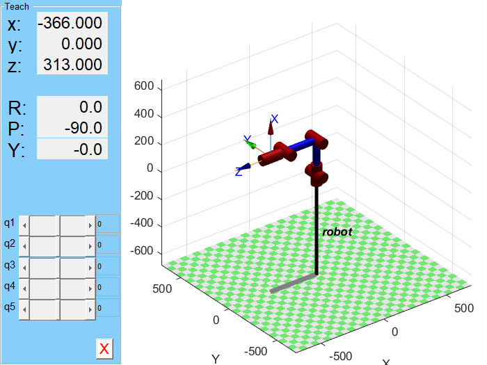

```matlab
q_init = [0, 0, 0, pi/2, 0];
Five_dof.plot(q_init);
```


### 4.7 常用工具箱函数

| 函数 | 功能 |
| --- | --- |
| `eul2tr(phi, theta, psi)` | 欧拉角 -> 旋转矩阵 |
| `rpy2tr(roll, pitch, yaw)` | RPY 角 -> 旋转矩阵 |
| `transl(x, y, z)` | 平移 -> 齐次变换矩阵 |
| `t2r(T)` | 变换矩阵中提取旋转部分 |
| `transl(T)` | 变换矩阵中提取平移部分 |
| `fkine(q)` | 正向运动学求解 |
| `ikine(T, 'mask', ...)` | 逆向运动学（数值法） |
| `ikunc(T)` | 逆运动学（忽略关节限制） |
| `plot(q)` | 图形化显示机械臂位姿 |
| `teach` | 示教模式 GUI |
| `mtraj(@tpoly, P1, P2, t)` | 轨迹插值生成 |
| `display()` | 打印 DH 参数表 |

### 4.8 运动学手动推导与验证

#### FK 手动推导

将改进 DH 参数代入通用齐次变换矩阵，手动计算每个关节的 $T_{i-1}^{i}$，逐级连乘得到 $T_0^5$ 并与工具箱 `fkine()` 结果对比。


验证结果：手动计算与工具箱输出完全一致。


> 注意：直接使用 `cos(pi/2)` 可能产生浮点误差。建议在计算时保留符号表达式再代入。

#### IK 手动推导

采用代数法，通过连乘逆矩阵的方式逐步分离各关节变量：

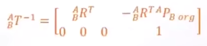


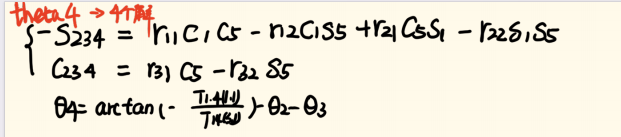

### 4.9 函数封装

将各模块封装为独立函数，便于复用和 C 语言移植。

| 函数 | 文件 | 说明 |
| --- | --- | --- |
| `T0_tool = FK(Angle_T, a, d, alpha, l)` | `FK.m` | 正运动学 |
| `theta = IK(T0_tool, a, d, l)` | `IK.m` | 逆运动学（返回 4 组解） |
| `angle = antiSinCos(sA, cA)` | `antiSinCos.m` | 反正切求解（处理边界） |
| `T_target = target_calc(x, y, z)` | `target_calc.m` | 目标坐标 -> 变换矩阵 |
| `path = path_calc(theta_s, theta_f, v_s, v_f, a_s, a_f, t)` | `path_calc.m` | 五轴轨迹规划 |
| 主测试脚本 | `main.m` | 串联所有函数，完整流程测试 |

**`antiSinCos` 辅助函数**：专门处理 sin=0 或 cos=0 的边界情况，避免 `atan2` 歧义。

```matlab
function angle = antiSinCos(sA, cA)
    eps = 1e-8;
    angle = 0;
    if (abs(sA) < eps) && (abs(cA) < eps)
        return;
    end
    if abs(cA) < eps
        angle = pi/2.0 * sign(sA);
    else
        angle = atan2(sA, cA);
    end
end
```

**`target_calc` 坐标系转换**：将目标物体坐标映射到机械臂末端执行器坐标系。

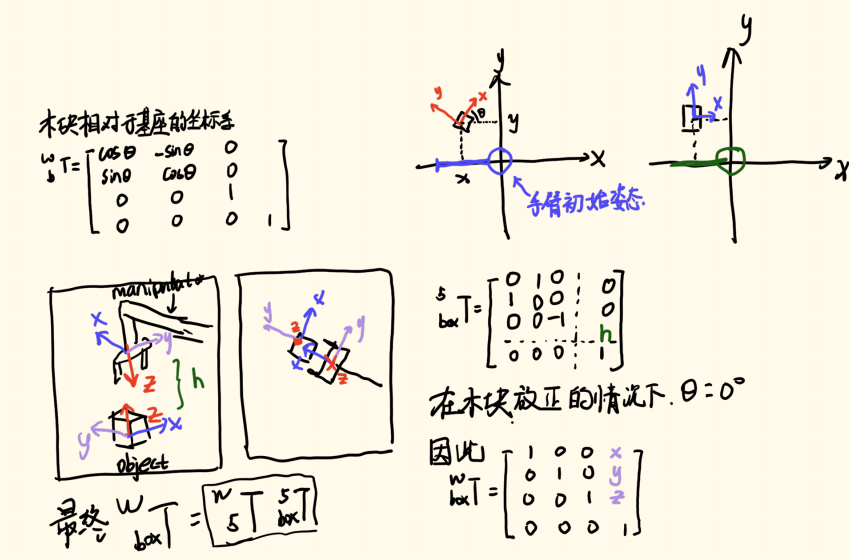

```matlab
function T_target = target_calc(x, y, z)
    T_objection = [1 0 0 x; 0 1 0 y; 0 0 1 0; 0 0 0 1];
    T_tool      = [0 1 0 0; 1 0 0 0; 0 0 -1 z+63; 0 0 0 1];
    T_target = T_objection * T_tool;
end
```

**`main.m` 综合测试**：依次测试 FK -> IK -> target_calc -> path_calc，验证全部模块正确性。

### 4.10 完整抓取仿真

模拟机械臂从初始位姿抓取目标物块并放置到指定位置的全过程。


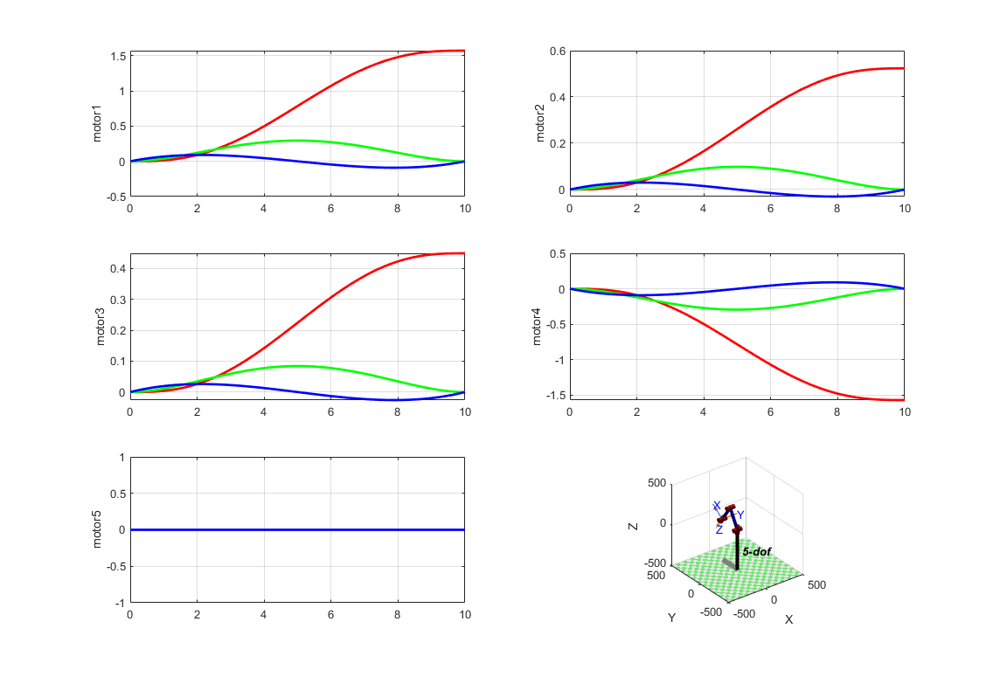

**仿真流程**：

| 阶段 | 时间 | 动作 |
| --- | --- | --- |
| 初始化 | T=0 | 机械臂回到零位 `[0, 0, 0, pi/2, 0]` |
| 抓取 | 0-5s | IK 解算目标角度 -> 五次多项式轨迹 -> 移动到物体上方 |
| 抬升 | 5-10s | 经 via point 过渡到过渡位姿 |
| 放置 | 10-15s | IK 解算放置角度 -> 轨迹规划 -> 移动到放置位置 |
| 归位 | 15-20s | 返回初始位姿 |

仿真过程中通过 `plot_sphere()` 可视化物块的实时位置变化。

---

## 5. 嵌入式软件

嵌入式软件基于 **STM32CubeMX** 生成初始化代码，使用 **MDK-ARM (Keil)** 作为开发环境，**FreeRTOS** 进行任务调度。

### 5.1 应用层 (App)

#### 5.1.1 逆运动学 (`IK.c / IK.h`)

**数据结构**：

```c
typedef __packed struct {
    int a[5];        // DH 参数 a
    int d[5];        // DH 参数 d
    float joint[5];  // 关节角度限制
} manipulator;
```

**核心函数**：

| 函数 | 功能 |
| --- | --- |
| `arctan(sa, ca)` | 根据 sin/cos 值安全求解角度，处理边界情况 |
| `target_T_get(x, y, z, T)` | 将目标坐标转换为 4x4 齐次变换矩阵 |
| `IK_calc(T, res)` | 逆运动学求解，返回 4 组候选解 |

**算法特点**：
- 与 MATLAB 版本算法一致（代数解析法）
- 针对嵌入式平台优化：使用 `atan2f`、`fabsf` 等单精度浮点函数
- 包含除零保护和越界判断

#### 5.1.2 轨迹规划 (`path_planning.c / path_planning.h`)

**数据结构**：

```c
typedef __packed struct {
    float theta[100];  // 角度序列
    float vel[100];    // 速度序列
    float acc[100];    // 加速度序列
} path_message;

typedef __packed struct {
    float theta[5];    // 5 关节角度
    float vel[5];      // 5 关节速度
    float acc[5];      // 5 关节加速度
} point;

typedef __packed struct {
    float t_s;               // 起始时间
    float t_f;               // 终止时间
    path_message joint_path[5]; // 5 个关节的轨迹
    point start;             // 起始点
    point end;               // 终止点
} path;
```

**核心函数**：

| 函数 | 功能 |
| --- | --- |
| `power(num, n)` | 计算 num 的 n 次方 |
| `one_path_cala(path)` | 计算单段五次多项式轨迹（4 个电机关节） |
| `path_planning(path)` | 执行完整轨迹，将角度值写入电机控制结构体 |

**轨迹执行**：将 100 个插值点依次写入 `motor_info[n].target_angle`，由 FreeRTOS 任务周期发送 CAN 指令驱动电机。

#### 5.1.3 控制数据 (`control_data.c / control_data.h`)

**数据结构**：

```c
typedef __packed struct {
    int16_t x;           // 目标 X 坐标
    int16_t y;           // 目标 Y 坐标
    int16_t z;           // 目标 Z 坐标
    int16_t kind;        // 物体类别
    int16_t channel[5];  // 各通道值
    int16_t start;       // 运动开始标志
    int16_t tool;        // 执行器控制
    int16_t mode;        // 模式选择
    int16_t function;    // 功能选择
    int16_t catch_flag;  // 抓取标志
    int16_t letter_num;  // 字母编号 (A=0, B=1, ...)
} Control_Data;
```

**物体类别编码**：字母 A-Z 映射为数字 0-24，用于 UART 通信中传递识别到的物体类别。

### 5.2 任务层 (Task)

| 任务 | 文件 | 功能 |
| --- | --- | --- |
| Kinemat_Task | `Kinemat_Task.c/.h` | 运动学计算任务：接收视觉数据，执行 IK 解算与轨迹规划 |
| Arm_Task | `Arm_Task.c/.h` | 机械臂控制任务：执行轨迹跟踪，发送 CAN 电机指令，控制夹爪 |

任务间通过全局数据结构（`Control_Data data`、`motor_info[]`）进行数据交换，由 FreeRTOS 信号量/队列进行同步。

### 5.3 设备层与驱动层

#### 电机驱动 (`Can_user.c/.h`)

**数据结构**：

```c
typedef struct {
    CAN_HandleTypeDef hcan;    // CAN 句柄
    uint16_t can_id;           // 电机 CAN ID
    uint16_t mode;             // 控制模式 (0=IMT, 1=位置速度, 2=速度)
    float position;            // 当前位置
    float velocity;            // 当前速度
    float torque;              // 当前转矩
    float target_speed;        // 目标速度
    float target_angle;        // 目标角度
    float target_T_ff;         // 前馈转矩
    float Kp, Ki, Kd;          // PID 参数
} motor_info_t;
```

**控制模式**：

| 模式 | 值 | 说明 |
| --- | ---: | --- |
| IMT 模式 | 0 | 力矩控制 (MIT Cheetah 模式) |
| 位置速度模式 | 1 | 位置环 + 速度环控制 |
| 速度模式 | 2 | 纯速度控制 |

**电机控制函数**：

| 函数 | 功能 |
| --- | --- |
| `MIT_CtrlMotor(hcan, id, pos, vel, KP, KD, torq)` | IMT 模式控制 |
| `PosSpeed_CtrlMotor(hcan, id, pos, vel)` | 位置速度模式控制 |
| `Speed_CtrlMotor(hcan, id, vel)` | 速度模式控制 |
| `Motor_enable()` | 使能全部电机 |
| `Motor_control()` | 主控制循环 |

**CAN 电机参数限制**（`bsp_can.h`）：

| 参数 | 最小值 | 最大值 |
| --- | ---: | ---: |
| 位置 P (rad) | -12.5 | 12.5 |
| 速度 V (rad/s) | -45 | 45 |
| Kp | 0 | 500 |
| Kd | 0 | 5 |
| 转矩 T (N·m) | -18 | 18 |

#### 舵机驱动 (`Servos.c/.h`)

```c
typedef struct {
    uint16_t channel_id;      // 通道 ID
    float position;           // 当前位置
    float velocity;           // 当前速度
    float torque;             // 当前转矩
    float target_speed;       // 目标速度
    float target_angle;       // 目标角度
    float target_T_ff;        // 前馈转矩
} servo_info_t;
```

支持 3 路舵机（含夹爪），通过 PWM 信号控制角度。

#### UART 通信 (`Uart_user.c/.h`)

```c
typedef __packed struct {
    int16_t x;    // X 坐标
    int16_t y;    // Y 坐标
    int16_t z;    // Z 坐标
} App_Data;
```

UART 使用 DMA 方式收发数据，支持中断收发模式，实现与上位机（视觉模块）的高速数据交互。

### 5.4 板级支持包 (BSP)

#### CAN 协议封装 (`bsp_can.c/.h`)

基于 STM32 HAL CAN 驱动，封装电机控制协议：

| 函数 | 功能 |
| --- | --- |
| `CANx_SendStdData(hcan, ID, pData, Len)` | 标准帧数据发送 |
| `can_filter_init()` | CAN 滤波器初始化 |
| `motor_commend(motor, pData)` | 电机指令编码 |

#### 通用类型定义 (`struct_typedef.h`)

为嵌入式平台统一定义固定宽度数据类型：

```c
typedef signed char        int8_t;
typedef signed short int   int16_t;
typedef signed int         int32_t;
typedef signed long long   int64_t;
typedef unsigned char      uint8_t;
typedef unsigned short int uint16_t;
typedef unsigned int       uint32_t;
typedef unsigned long long uint64_t;
typedef float              fp32;
typedef double             fp64;
```

### 5.5 控制数据协议

视觉模块与 STM32 之间通过 UART 串口传输的控制数据包含：目标类别（kind）、三维坐标（x, y, z）、控制标志位（start, catch_flag, mode）等。数据解析由 `control_data.c` 中的中断回调完成，解析后触发 Kinemat_Task 进行运动学解算与轨迹规划。

### 5.6 时钟树配置

STM32F446 使用外部晶振，通过 PLL 倍频至 180MHz 作为系统主频。各外设总线时钟分配如下：

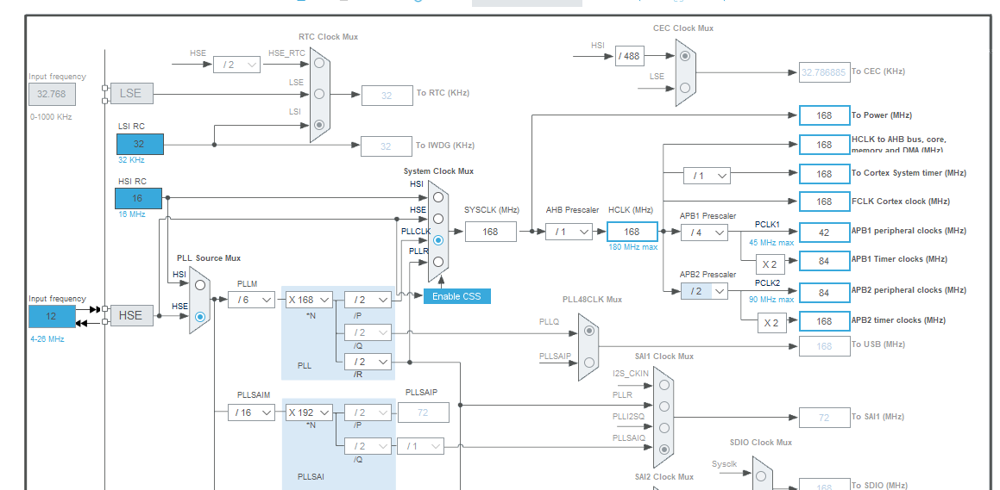

### 5.7 蓝牙模块与 UART DMA 接收

采用 **CH05 蓝牙模块** 与控制器通信，通过上位机 APP 发送控制指令。

**硬件接线**：

| 蓝牙模块 | STM32 引脚 | 功能 |
| --- | --- | --- |
| RX | PC06 (USART6_TX) | 蓝牙接收 -> 单片机发送 |
| TX | PC07 (USART6_RX) | 蓝牙发送 -> 单片机接收 |

.png)
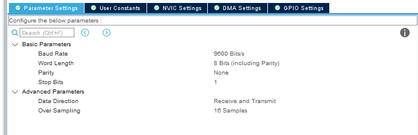

**数据包格式（17 字节）**：

| 字节 | 内容 |
| --- | --- |
| [0] | 包头 0xA5 |
| [1-2] | x 坐标 (int16) |
| [3-4] | y 坐标 (int16) |
| [5-6] | z 坐标 (int16) |
| [7-14] | 速度控制 v_int[4] (4x int16) |
| [15] | 保留 |
| [16] | 包尾 0x5A |

**UART 初始化与中断处理**：

UART6 配置为 DMA + 空闲中断模式。每收到一帧完整数据（17 字节），在 `HAL_UART_RxCpltCallback` 中按状态机解析：

1. `RxState=0`：检测包头 `0xA5`
2. `RxState=1`：解析坐标和速度字段
3. `RxState=2`：验证包尾 `0x5A`，确认后重新使能 DMA

对应的控制数据结构 (`control_data.h`)：

```c
typedef __packed struct {
    int16_t x;           // 机械臂位置 X
    int16_t y;           // 机械臂位置 Y
    int16_t z;           // 机械臂位置 Z
    int16_t v_int[4];    // 速度控制（4 个值）
    int16_t key[6];      // 按键信息
} Control_Data;
```

### 5.8 SG90 舵机与 PWM 配置

#### 舵机 PWM 参数计算

SG90 舵机使用 TIM3 定时器（挂载在 APB1 总线，频率 84MHz）的 CH4 通道输出 PWM。定时器配置为：

- 预分频器 (PSC)：83 -> 定时器时钟 = 84MHz / (83+1) = 1MHz
- 自动重装载 (ARR)：19999 -> PWM 频率 = 1MHz / (19999+1) = 50Hz

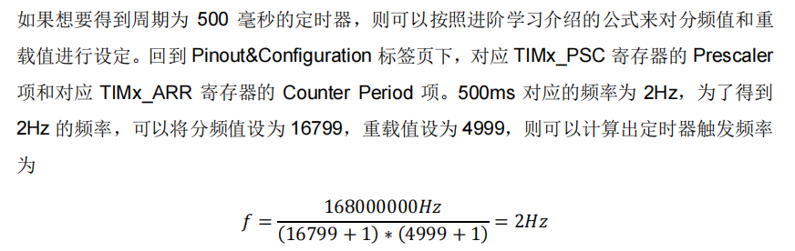
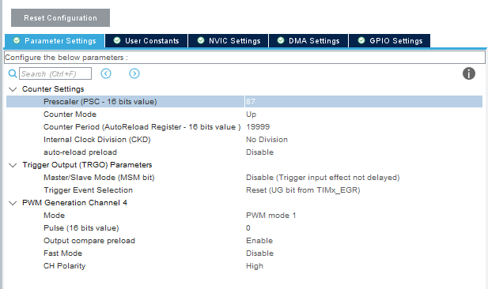

**角度与 PWM 占空比对应关系**：

| 角度 | CCR 值 | 占空比 |
| ---: | ---: | --- |
| 0 | 500 | 2.5% |
| 45 | 1000 | 5% |
| 90 | 1500 | 7.5% |
| 135 | 2000 | 10% |
| 180 | 2500 | 12.5% |

**舵机控制函数 (`Servos.c`)**：

```c
void servos_init() {
    HAL_TIM_PWM_Start(&htim3, TIM_CHANNEL_4);
}

// angle: 0~180 度
void servos_control(uint16_t angle) {
    float temp = angle * (2500.0 / 127.0);
    if (temp < 0) temp = -temp;
    __HAL_TIM_SET_COMPARE(&htim3, TIM_CHANNEL_4, temp);
}
```

#### 夹爪舵机

夹爪同样由 SG90 舵机驱动，通过独立的 PWM 通道控制开合。


### 5.9 CAN 电机控制实现

#### 电机指令编码

`Can_User.c` 定义四组全局指令数组用于电机管理：

| 数组 | 值（最后字节） | 功能 |
| --- | --- | --- |
| `Data_Enable[8]` | 0xFC | 电机使能 |
| `Data_Failure[8]` | 0xFD | 电机失能 |
| `Data_Save_zero[8]` | 0xFE | 保存零点位置 |
| `Data_Error_clear[8]` | 0xFB | 清除错误 |

**模式切换**：根据 `motor.mode` 自动偏移 CAN ID：

| mode | ID 偏移 | 模式 |
| ---: | ---: | --- |
| 0 | +0x000 | MIT 模式 |
| 1 | +0x100 | 位置速度模式 |
| 2 | +0x200 | 速度模式 |

#### CAN 滤波器配置

初始化时配置两个 CAN 外设的滤波器为全通模式（ID Mask = 0），并启用 FIFO0 消息挂起中断。

#### 标准帧发送函数

`CANx_SendStdData(hcan, ID, pData, Len)` 遍历三个发送邮箱，将数据帧发出。发送失败时自动尝试下一个邮箱，确保发送可靠性。

#### C 语言路径规划实现

**求幂辅助函数**：

```c
float power(float num, uint16_t n) {
    float res = 1;
    for (uint16_t i = 0; i < n; i++) {
        res = res * num;
    }
    return res;
}
```

**轨迹规划执行流程**：

1. `one_path_cala(path)` 计算五次多项式系数，生成 100 个插值点的角度/速度/加速度序列
2. `path_planning(path)` 遍历 100 个插值点，将 `theta` 写入 `motor_info[id].target_angle`，通过 `osDelay()` 控制时序
3. 关节角度映射关系：

```c
motor_info[0].target_angle =  path->joint_path[0].theta[index];
motor_info[1].target_angle = -path->joint_path[1].theta[index];
motor_info[2].target_angle =  path->joint_path[2].theta[index];
motor_info[3].target_angle = -path->joint_path[3].theta[index] + pi/2;
motor_info[4].target_angle =  path->joint_path[4].theta[index];
```

负号用于补偿电机安装方向差异，`+pi/2` 补偿关节 4 的初始偏置。

**验证结果**：通过 CubeMonitor 观测，C 语言实现的轨迹与 MATLAB 仿真完全一致。

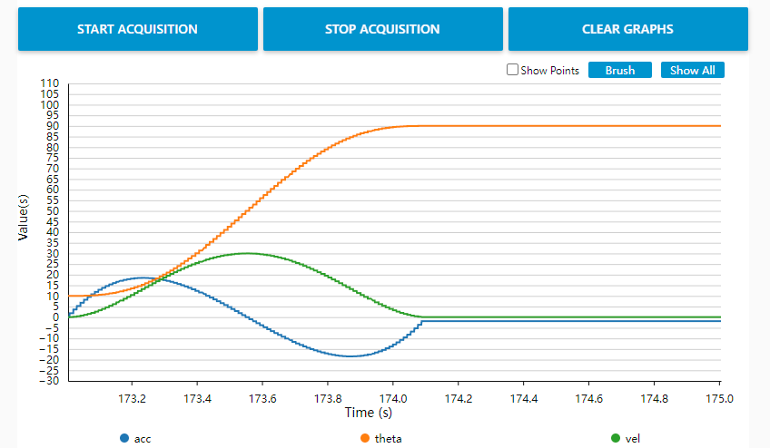
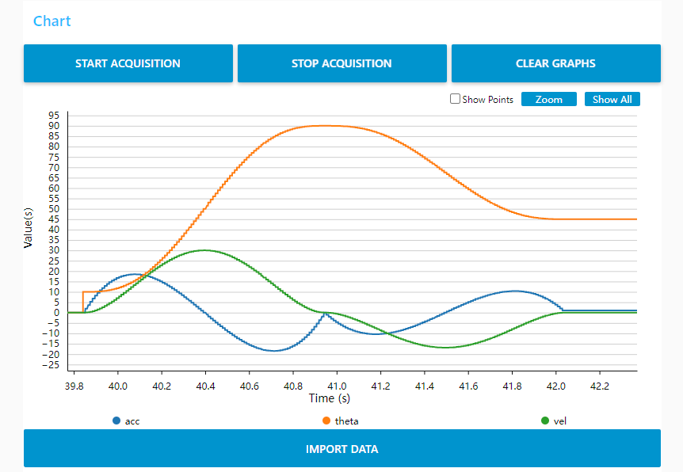
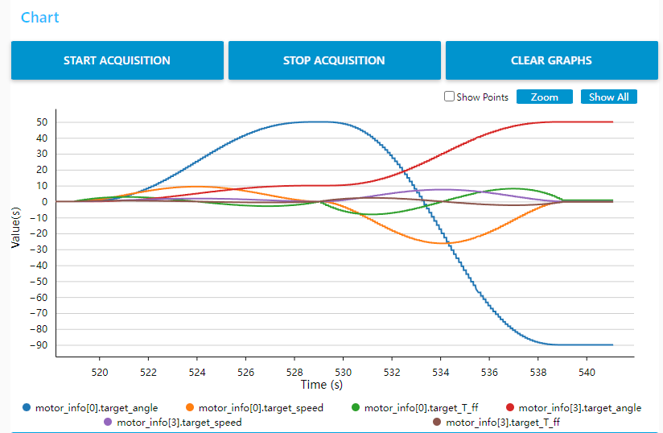

#### C 语言 IK 逆解实现

`IK_calc(T, res)` 函数与 MATLAB 版本采用相同代数法，区别在于：

- 使用 `atan2f`、`fabsf` 等单精度浮点函数优化性能
- 无解情况下标记为 `255`（8-bit 哨兵值）
- 解筛选逻辑：逐组检查关节 1/2/3 是否在限位范围内（[-2,2], [-1,1], [-1.67,0.9] rad）

---

## 6. 视觉模块

视觉模块 (`vision/last_project.py`) 运行在 Jetson Nano 或 PC 端，基于 Python 实现。

### 核心功能

| 功能 | 实现方式 |
| --- | --- |
| 目标检测 | YOLOv5 模型推理，识别预设类别物体 |
| 深度定位 | 双目深度相机获取像素点三维坐标 |
| 坐标转换 | 像素坐标转世界坐标，mm 转 m |
| 数据打包 | 将类别编号、(x, y, z)、距离打包为结构体 |
| 串口发送 | 通过 UART (115200bps) 发送至 STM32 |

### 串口数据包格式

| 字段 | 字节 | 说明 |
| --- | ---: | --- |
| 包头 | 1 | 0xFE |
| 类别 | 2 | int16 (A=0, B=1, ...) |
| X 坐标 | 2 | int16 (mm) |
| Y 坐标 | 2 | int16 (mm) |
| Z 坐标 | 2 | int16 (mm) |
| 距离 | 2 | int16 (cm) |
| 包尾 | 1 | 0xEF |

数据通过 `struct.pack('h', ...)` 将 int16 值拆分为两个字节，由 `trans_Byte()` 函数处理。

### 目标类别映射

| 字母 | A | B | C | D | E | F | G | H | I | J | ... | Z |
| --- | --- | --- | --- | --- | --- | --- | --- | --- | --- | --- | --- | --- |
| 编号 | 0 | 1 | 2 | 3 | 4 | 5 | 6 | 7 | 8 | 9 | ... | 24 |

---

## 7. 机械结构

机械结构使用 **SolidWorks** 设计，装配体文件为 `Solid Works/超级修改臂.SLDASM`。

- 5 轴旋转关节 + 1 末端夹爪
- 主要连杆采用铝合金/3D 打印结构件
- 关节由达妙无刷电机驱动，通过同步带/谐波减速器传动
- 夹爪由 SG90 舵机驱动

---

## 8. 开发环境与工具链

| 工具/环境 | 用途 | 版本/说明 |
| --- | --- | --- |
| MATLAB | 运动学仿真、轨迹规划 | Robotics Toolbox (Peter Corke) |
| STM32CubeMX | 外设初始化代码生成 | STM32F4 系列 |
| Keil MDK-ARM | 嵌入式固件编译、调试 | ARM Compiler 5/6 |
| Visual Studio Code | 代码编辑 | 配合 Keil 使用 |
| Python | 视觉识别与通信 | 3.8+ / YOLOv5 / OpenCV |
| SolidWorks | 机械结构设计 | 三维装配模型 |
| FreeRTOS | 实时操作系统 | CMSIS-RTOS v1/v2 封装 |

---

## 9. 通信协议

### 9.1 CAN 总线

用于主控与 4 个关节电机之间的实时通信。

| 参数 | 值 |
| --- | --- |
| 波特率 | 1 Mbps |
| 帧格式 | 标准帧 (11-bit ID) |
| 数据长度 | 8 字节 |
| 控制频率 | ~1 kHz |

**电机指令帧格式**（8 字节）：

| 字节 | 内容 |
| --- | --- |
| [0-1] | 位置指令 (uint16 -> float 映射) |
| [2-3] | 速度指令 (uint16 -> float 映射) |
| [4-5] | Kp 参数 |
| [6-7] | Kd 参数 / 转矩前馈 |

参数映射公式：

```
p_int = float_to_uint(position, P_MIN, P_MAX, 16)
v_int = float_to_uint(velocity, V_MIN, V_MAX, 16)
kp_int = float_to_uint(Kp, KP_MIN, KP_MAX, 16)
kd_int = float_to_uint(Kd, KD_MIN, KD_MAX, 16)
```

### 9.2 UART 串口

用于视觉模块与主控之间的数据交换。

| 参数 | 值 |
| --- | --- |
| 波特率 | 115200 bps |
| 数据位 | 8 |
| 停止位 | 1 |
| 校验位 | 无 |
| 传输方式 | DMA + 空闲中断 |

---

*文档版本：v1.1 | 最后更新：2026 年 5 月*

